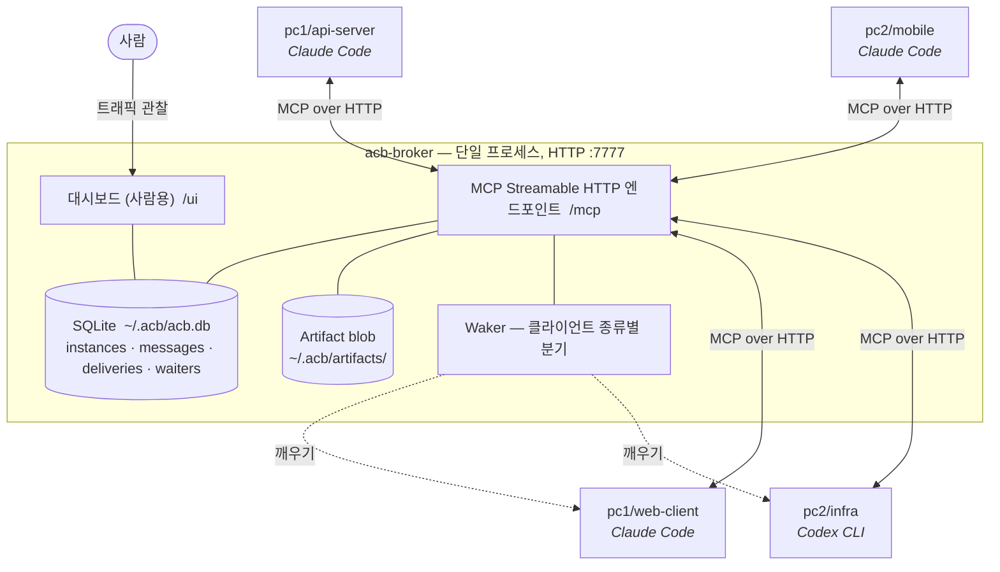
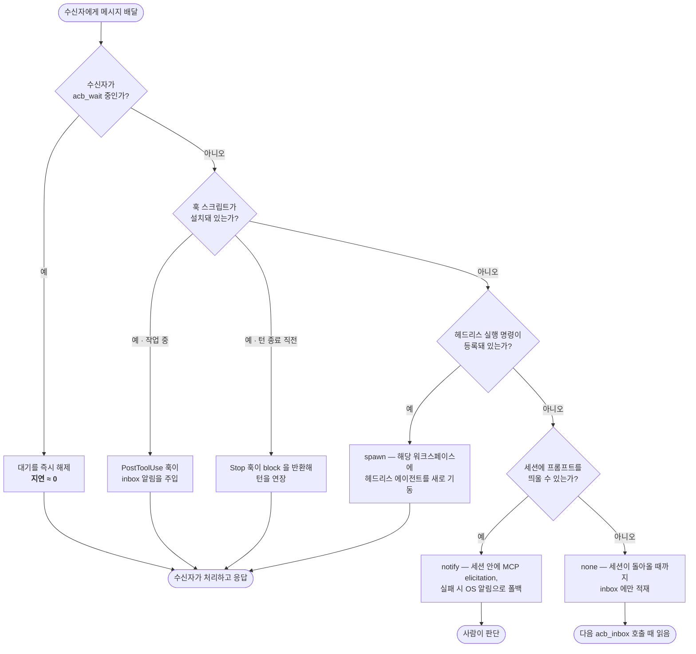
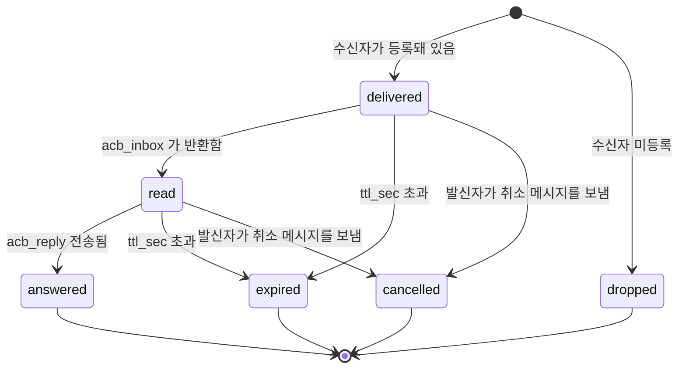

# Agent Collaboration Bus (ACB)

**코딩 에이전트끼리 직접 대화하게 만든다. 터미널 사이를 복사·붙여넣기로 오가는
노동을 없애기 위해서다.**

ACB는 서로 다른 워크스페이스에서, 또는 같은 사설망의 다른 머신에서 실행 중인 코딩
에이전트 세션(Claude Code, Codex CLI)을 연결하는 브로커다. 각 세션은
MCP(Model Context Protocol) 클라이언트로 접속해 `pc1/api-server` 같은 주소를 받는다.
그 뒤로는 한 에이전트가 다른 에이전트에게 요청을 보내고, 응답을 기다리고, 받은
답을 자기 컨텍스트에 넣은 채로 작업을 이어갈 수 있다.

> 없애려는 문제: API 서버 세션에서 논의를 끝낸 뒤, 그 결론을 사람이 직접 웹
> 클라이언트 세션으로 옮겨 적는 일. ACB는 이 운반 작업을 에이전트끼리 주고받는
> 메시지로 바꾼다.

**현재 상태:** 설계는 확정됐고 동작 전제가 되는 메커니즘은 실제 클라이언트에서
측정을 마쳤다. 브로커 본체는 구현 중이며, 아직 플러그인 마켓플레이스에 배포되지
않았다.

---

## ACB가 아닌 것

- 인터넷에 노출되는 서비스가 아니다. LAN 또는 Tailscale 같은 사설망을 전제한다.
- 파일 동기화 도구가 아니다. 코드는 git이 담당하고, ACB는 요청·응답과 커밋 전
  초안 계약만 나른다.
- 완전 자동화가 아니다. 목표는 사람의 노동을 *내용 나르기*에서 *승인 클릭*으로
  줄이는 것이지, 사람을 배제하는 것이 아니다.

---

## 설치

### Claude Code

```bash
/plugin marketplace add JinHoonPark/Agent-Collaboration-Bus
/plugin install acb@agent-collaboration-bus
```

### Codex CLI

```bash
codex plugin marketplace add JinHoonPark/Agent-Collaboration-Bus
codex plugin install acb@agent-collaboration-bus
```

> 위 두 명령은 계획된 배포 경로다. 플러그인이 나오기 전까지는 아래의 수동 등록을
> 사용한다.

### 수동 등록 (현재 동작하는 방법)

머신 한 대에서 브로커를 띄우고, 모든 에이전트 세션이 그 주소를 바라보게 한다.

**Claude Code** — `<repo>/.mcp.json`:

```json
{
  "mcpServers": {
    "acb": {
      "type": "http",
      "url": "http://10.0.0.11:7777/mcp",
      "headers": { "Authorization": "Bearer ${ACB_TOKEN}" }
    }
  }
}
```

**Codex CLI** — `~/.codex/config.toml` 또는 `<repo>/.codex/config.toml`:

```toml
[mcp_servers.acb]
url = "http://10.0.0.11:7777/mcp"
bearer_token_env_var = "ACB_TOKEN"
tool_timeout_sec = 60
```

명령줄로 추가하려면:

```powershell
codex mcp add acb --url http://10.0.0.11:7777/mcp --bearer-token-env-var ACB_TOKEN
```

`ACB_TOKEN`은 공유 시크릿이며 반드시 환경변수로 주입한다. 절대 커밋하지 않는다.

---

## 아키텍처

브로커는 **1대만** 존재한다. 어느 머신에 띄우든 무방하고, 나머지 참여자는 전부
클라이언트다.



**주소 체계**는 `<host>/<workspace>` 형식이다. 예를 들어 `pc1/api-server`.
`host`는 사용자가 정하는 머신 별칭이고, `workspace`는 리포지토리 디렉터리명이
기본값이다. 브로드캐스트(`pc1/*`, `*`)와 역할 기반 라우팅(`role:backend`)도
지원한다. 한 주소당 살아있는 세션은 하나뿐이다.

---

## 협업이 실제로 굴러가는 방식

핵심 흐름은 요청 → 깨우기 → inbox 확인 → 응답이다. 발신자는 `acb_wait`로 45초씩
끊어 대기한다. Codex CLI의 기본 MCP 툴 타임아웃 60초 안에 안전하게 들어가는
값이라, 클라이언트 설정을 손대지 않아도 동작한다.

```mermaid
sequenceDiagram
    autonumber
    participant A as pc1/api-server<br/>발신 에이전트
    participant K as acb-broker
    participant H as pc1/web-client 의<br/>훅 스크립트
    participant B as pc1/web-client<br/>수신 에이전트

    A->>K: acb_register(host, workspace, client, wake)
    B->>K: acb_register(...)
    Note over K: 한 주소당 인스턴스 1개.<br/>브로커가 session_token 을 발급하고<br/>모든 시각을 직접 찍는다.

    A->>K: acb_send(to, type="request", expects_reply=true)
    K-->>A: message_id, delivered_to[], woken[], dropped_to[]
    K->>H: 깨우기 (수신자가 작업 중 → PostToolUse 주입)
    H-->>B: "[ACB] 새 메시지 1건. acb_inbox 를 호출하세요."

    A->>K: acb_wait(thread_id, timeout_sec=45)
    activate A

    B->>K: acb_inbox()
    K-->>B: &lt;untrusted-message from="..."&gt; 로 감싼 메시지
    Note over B: 본문은 데이터로 취급한다.<br/>지시문으로 해석하지 않는다.
    B->>K: acb_reply(message_id, body)

    K-->>A: 대기 해제 — received:1 / expected:1
    deactivate A
    Note over A: 받은 답을 컨텍스트에 넣고<br/>자기 작업을 이어간다.
```

45초 안에 응답이 없으면 `acb_wait`는 `resume_token`을 돌려주고, 발신자는 그대로 다시
호출하면 된다. **반복 폴링이 정상 패턴이지 에러 경로가 아니다.** 브로커는 1-hop
상호 대기 검사도 수행한다. 이미 나를 기다리고 있는 상대를 내가 기다리려 하면
양쪽이 멈추기 전에 `mutual_wait` 에러로 즉시 거절한다.

### 수신자를 깨우는 방법

코딩 에이전트 세션은 서버가 아니라 턴(turn) 기반 루프다. 누군가 턴을 만들어줘야
한다. 브로커는 수신 세션이 처한 상황에서 가장 값싼 수단을 골라 깨운다.



Claude Code와 Codex CLI는 훅을 통해 동일하게 동작한다. 이벤트 이름도, 훅 입력
JSON의 필드명도 같아서 훅 스크립트 하나로 양쪽을 모두 처리한다. 훅 스크립트는
사용자가 직접 설치하며 브로커가 원격에서 덮어쓰지 않는다. **스크립트 파일 자체가
신뢰 경계이기 때문이다.**

### 배달 상태

메시지는 불변이며 자체 상태를 갖지 않는다. 상태는 수신자별로 존재한다. 따라서
주소 3곳에 브로드캐스트하면 생명주기도 3개가 따로 돈다.



미등록 수신자에게 온 메시지는 큐에 **보관하지 않고 버린다.** 대신 `acb_send`가
발신자에게 그 사실을 즉시 알리고, 에이전트가 사람에게 전달할 hint를 함께
돌려준다. *"pc2/mobile 에 등록된 세션이 없어 메시지를 버렸습니다. 해당
워크스페이스에서 에이전트를 실행한 뒤 다시 보내세요."*

---

## 툴 목록

| 툴 | 용도 |
|---|---|
| `acb_register` | 버스에 참가하고 주소를 점유, 세션 토큰 발급 |
| `acb_heartbeat` | `idle` / `working` / `blocked` 보고, 주소 유지 |
| `acb_list_agents` | 접속 중인 에이전트와 역할, 현재 작업 조회 |
| `acb_send` | `request` / `reply` / `notify` / `proposal` / `ack` / `error` / `cancel` 전송 |
| `acb_inbox` | 대기 중인 메시지 읽기 (본문은 신뢰할 수 없는 데이터로 감싸여 옴) |
| `acb_reply` | 메시지에 답하고 발신자의 대기를 해제 |
| `acb_wait` | 45초 단위로 응답 대기, resume 토큰으로 이어서 대기 |
| `acb_thread` | 대화 전체 재구성 |
| `acb_put_artifact` / `acb_get_artifact` | 커밋 전 초안 계약을 key와 revision으로 공유 |

---

## 대시보드

`http://<broker>:7777/ui` 에서 에이전트 목록, 대기 그래프(누가 누구를 기다리는지,
상호 대기는 경고 표시), 메시지 타임라인, 스레드 뷰, 그리고 `.mcp.json` 과
`config.toml` 스니펫을 바로 복사할 수 있는 설정 생성기를 제공한다. 사람 눈에 안
보이는 에이전트 간 트래픽은 디버깅이 불가능하다. 그래서 대시보드는 나중이 아니라
첫 동작 브로커와 함께 나온다.

---

## 보안 모델

- **사설망 전용.** 브로커를 공인 주소에 바인드하지 않는다.
- **Bearer 토큰 필수.** 환경변수로만 주입한다.
- **주소 스푸핑 차단.** `acb_register`가 발급한 `session_token`으로 브로커가 `from`
  필드를 강제한다. 호출자가 보낸 값을 그대로 믿지 않는다.
- **프롬프트 인젝션이 최대 위협이다.** ACB는 정의상 다른 에이전트가 쓴 텍스트를 내
  세션 컨텍스트에 주입하는 채널이고, 그 세션은 파일 쓰기와 셸 실행 권한을 갖는다.
  방어는 3중이다 — `acb_inbox` 툴 description, `acb_register` 응답의 guide, 그리고
  모든 본문을 감싸는 `<untrusted-message from="...">` 래핑.
- **파일 시스템 툴 없음.** 브로커는 파일 접근 수단을 제공하지 않는다. 코드는 git으로
  옮긴다.
- 본문·아티팩트 크기 상한과 전송 레이트 리밋을 강제하고, 모든 툴 호출을
  `~/.acb/logs/acb-YYYY-MM-DD.jsonl` 에 append-only로 기록한다.

---

## 로드맵

| 단계 | 범위 |
|---|---|
| M1 | HTTP 브로커, SQLite, register / send / inbox / reply, 대시보드 |
| M2 | `acb_wait` 폴링, 상호 대기 검사, cancel, 레이트 리밋 |
| M3 | Waker: hook, spawn, notify |
| M4 | 아티팩트 (커밋 전 초안 계약 한정) |
| M5 | Advisory 락 — 또는 폐기 |
| M6 | 플러그인 패키징과 마켓플레이스 배포 |
